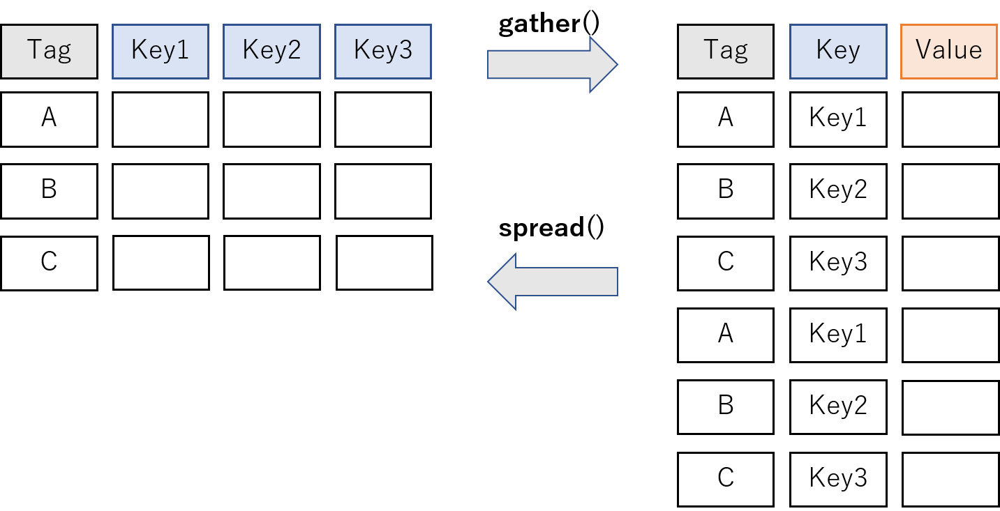
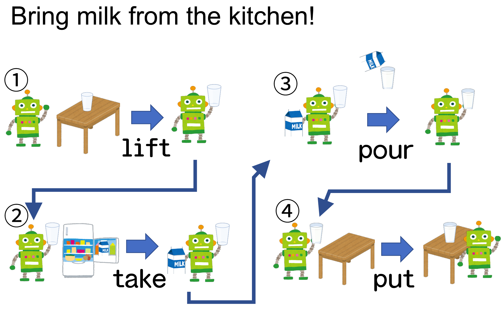
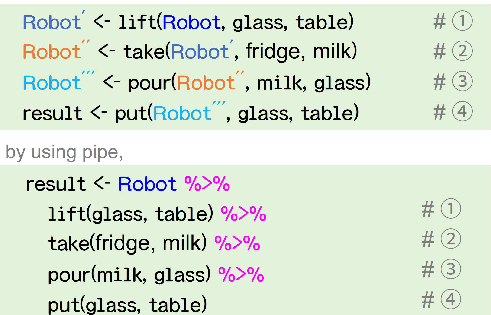
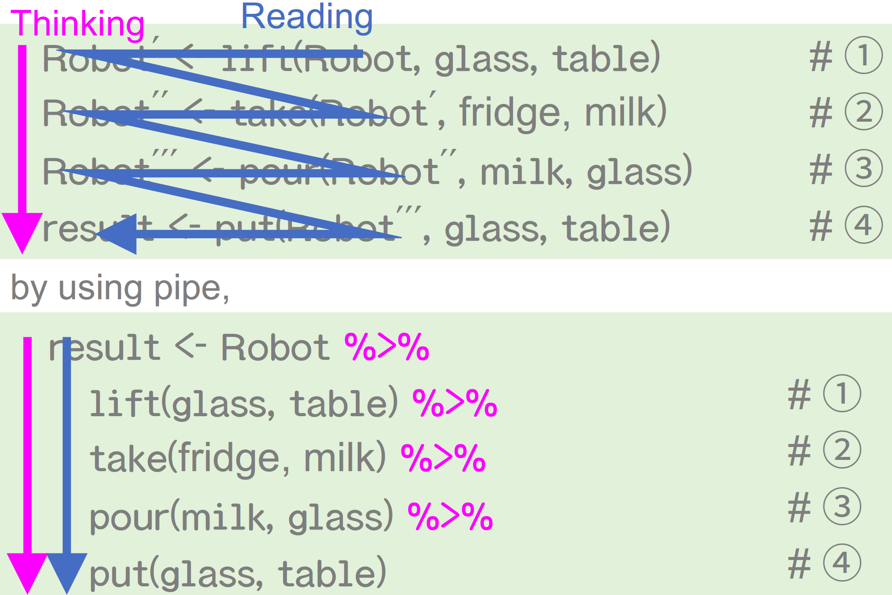

```{r setup, include=FALSE}
knitr::opts_chunk$set(echo = TRUE,
                      eval = TRUE,
                      warning = FALSE,
                      message = FALSE,
                      comment = "",
                      fig.height = 10,
                      fig.width = 10,
                      out.height = 300,
                      out.width = 300)
options(dplyr.print_max = 1e9)
```

# はじめに

## 誰？

<div class="column1">
- 松村優哉
- <u>Twitter</u>: **y\_\_mattu**
- <u>GitHub</u>: **ymattu**
- 今月から社会人
- 専門わず: 計量経済学、ベイズ統計、因果推論、マーケティング
- 言語: R, Python
- https://ymattu.github.io/
- http://y-mattu.hatenablog.com/
- Tokyo.R 運営(雑用, 音響)
</div>

<div class="column2">

</div>

## 著書(共著)
#### **R ユーザのための RStudio[実践]入門 <br> − tidyverse によるモダンな分析フローの世界−**
<div class="column1">

</div>

<div class="column2">
通称: 「**宇宙本**」

1. RStudio 入門(@y\_\_mattu)
2. スクレイピングによるデータ取得(@y\_\_mattu)
3. dplyr を中心としたデータハンドリング(@yutannihilation)
4. ggplot2 による可視化(@kyn02666)
5. R Markdown によるレポーティング(@kazutan)

</div>

# データハンドリング {#datahandling}
## データ分析の流れ {#datascienceflow1}
<div class="column1">
```{r echo=FALSE}
library(DiagrammeR)
grViz("
digraph data_analytics {
      # graph
      graph [overlap = true, fontsize = 10]
      # node
      node [shape=box,
      fontname = Helvetica,
      style = filled,
      fillcolor = SteelBlue,
      fontcolor = white]
      前処理;
      node [shape = box,
      fontname = Helvetica,
      fillcolor = Gray,
      fontcolor = black]
      データ取得; 可視化・モデリング;
      # edge
      データ取得->前処理
      前処理->可視化・モデリング
      }
      ")
```
</div>

<div class="column2">
### やること
縦横変換
- 絞り込み(列・行)
- 新しい変数の作成
- 集計
- テーブルのマージ
- etc...
→分析できる形に整形
</div>

## 今日のおはなし
1. tidyverse
2. tidy data
2. dplyr
3. FAQ

初心者(Rを使い始めた、ちょっと触ったことがある方)向けの内容です

# 本題のまえに {#firstofall}
## R とパッケージ {#rpackage0}
### ざっくり
- R はパッケージで機能を拡張することができる
- パッケージには機能特化の関数が詰まっている
- `install.packages()` でインストール


## パッケージ内の関数の表記
readr パッケージの read_csv() 関数を使いたいとき
```{r eval=FALSE}
# 方法 1
library(readr)
dat <- read_csv("hoge.csv")
# 方法 2
dat <- readr::read_csv("hoge.csv")
```

## tidyverse について {#abouttidyverse}
### tidyverse(概念)
ざっくり:

- R でやるいろんな操作(データハンドリング、可視化、スクレイピング、分析、etc)を直感的で統一的なインターフェースでできるようになったら嬉しくない?

### **tidyverse** パッケージ
- 上記の概念を実現するためのコアパッケージ群
- `install.packages("tidyverse")`でインストール

## tidyverse を読み込み {#library_tidyverse}
<div class="column1">
```{r,message=TRUE}
library(tidyverse)
```
</div>

<div class="column2">
読み込まれるパッケージ

- ggplot2: 可視化
- dplyr: データの操作
- tidyr: データを tidy に
- readr: データの読み書き
- purrr: 関数型プログラミング
- stringr: 文字列の操作
- forcats: 因子型データの操作
- tibble: tibble というモダンなデータフレーム
</div>

## 本日の主役は {#shuyaku}
<div class="column1">


</div>

<div class="column2">
#### 特徴
パッケージを使わないやり方より

- (大きいデータだと特に) <br> 速い
- 簡単 <br> ≒　わかりやすい
- 他の tidyverse のパッケージと相性がいい
</div>

## この発表のゴール {#todaysgoal}
- tidy data についてざっくり理解する
- R の **dplyr** パッケージで簡単な集計ができるようになること
- dplyr や他のパッケージで何ができるのかをなんとなく把握して、「ググり力」を身につける
- パッケージ名だけでも覚えて帰ってくださいね m(__)m


# tidy data {#tidydata}
## データの形式 {#data_format}
２つのデータ形式(例: カテゴリごとの購買金額(千円))

<div class="column1">
### Wide 型
```{r echo=FALSE}
dat_messy <- tibble(user = c('A', 'B', 'C'),
                    category1 = c(10, 15, 8),
                    category2 = c(2, 4, 5))
dat_messy %>%
  DT::datatable(extensions = 'FixedColumns',
  options = list(
    dom = 't',
    scrollX = TRUE,
    scrollCollapse = TRUE
  ))
```
</div>

<div class="column2">
### Long 型
```{r echo=FALSE}
dat_tidy <- dat_messy %>%
  gather(key = category, value = sum_price, -user)
dat_tidy %>%
  DT::datatable(extensions = 'FixedColumns',
  options = list(
    dom = 't',
    scrollX = TRUE,
    scrollCollapse = TRUE
  ))
```
</div>

## tidy data {#def_tidydata}
- 2016 年に Hadley Wickham 氏が提唱
- 定義
    - **1つの列が1つの変数を表す**
    - **1つの行が1つの観測を表す**
    - **1つのテーブルが1つのデータセットを含む**
- Rでのtidy data は、Long 型。

## tidyr (〜2019/09/11) {#tidyr}


## tidyr 1.0.0 (2019/09/11〜) {#tidyr}


## 詳しくは 
[Tokyo.R #79 の応用セッション](https://speakerdeck.com/yutannihilation/tidyr-pivot ) を参照。


# dplyr {#nowdplyr}

# 本日のデータ {#todaysdata}
## EC サイトのログデータ {#ecsitedata}
- を意識して作ったダミーデータ
- https://github.com/ymattu/sampledata_small


## データの読み込み方 {#prepare_data}
1. RStudio のプロジェクトを作成
2. Terminal ペインで以下を実行 <br> `git clone https://github.com/ymattu/sampledata_small`
3. readr パッケージの関数で読み込み
```{r }
sales <- read_csv("sampledata_small/csv/Sales.csv")
product <- read_csv("sampledata_small/csv/Products.csv")
user_master <- read_csv("sampledata_small/csv/UserMaster.csv")
```
データ読み込みについて詳しくは[こちら](https://ymattu.github.io/TokyoR66/slide.html#/)も参照

# **dplyr** {#dplyr}
## 列選択 {#select}
```{r, eval=FALSE}
sales %>%
  select(UserID) %>%
  head()
```
```{r,echo=FALSE}
sales %>%
  select(UserID) %>%
  head() %>%
  DT::datatable(extensions = 'FixedColumns',
  options = list(
    dom = 't',
    scrollX = TRUE,
    scrollCollapse = TRUE
  ))
```

## %>% {#pipe}
#### パイプ演算子 {#pipe_operator}
- "これまでの処理を次の関数の第 1 引数として渡す」という働き"
```{r }
1:3 %>%
  sum()
```
```{r eval=FALSE}
# これと全く同じ
sum(1:3)
```

## なんでパイプ演算子が必要なのか? {#necessarity_pipe}

[Tokyo.R#76 BeginneRSession-data pipeline](https://speakerdeck.com/kilometer/tokyo-dot-r-number-76-beginnersession-data-pipeline)

## どう書くのか問題 {#howtowrite}


## 思考の流れと書く流れ {#pipeline}


## パイプ演算子を使うときのポイント {#hint_pipe}
`結果 <- スタート地点` を書いて、やりたい処理をパイプでつないでいく

## 列選択のやりかたいろいろ {#selectfunctions}
```{r, eval=FALSE}
product %>%
  select(starts_with("P")) %>%
  head(4)
```
```{r, echo=FALSE}
product %>%
  select(starts_with("P")) %>%
  head(4) %>%
  DT::datatable(extensions = 'FixedColumns',
  options = list(
    dom = 't',
    scrollX = TRUE,
    scrollCollapse = TRUE
  ))
```

## 列選択のやりかたいろいろ 2 {#selectfunctions2}
例
```{r eval=FALSE}
select(product, 1:3) # 列番号が連続している場合
select(product, ProductID:Price) # 列名でも連続していれば同様
select(product, -CreatedDate) # 特定の列を除く
select(product, -4) # 特定の列番号を除く
select(product, starts_with("p"), ignore.case = TRUE) # 大文字小文字を無視
select(product, matches("^(Product|Price)")) # "Product"または"Price"で始まる列を選択
```

## 列追加 {#mutate}
- 税込み価格を計算
```{r, eval=FALSE}
product %>%
  mutate(zeikomi = Price * 1.08) %>%
  head(4)
```
```{r, echo=FALSE}
product %>%
  mutate(zeikomi = Price * 1.08) %>%
  head(4) %>%
  DT::datatable(extensions =  'FixedColumns',
  options = list(
    dom = 't',
    scrollX = TRUE,
    scrollCollapse = TRUE
  ))
```

## 行の絞り込み {#filter}
```{r, eval=FALSE}
user_master %>%
  filter(Age >= 20, Sex == "F") # 年齢 20 歳以上の女性
```
```{r, echo=FALSE}
user_master %>%
  filter(Age >= 20, Sex == "F") %>%
  DT::datatable(extensions =  'FixedColumns',
  options = list(
    deferRender = TRUE,
    dom = "t",
    scrollX = TRUE,
    scrollY = 200,
    scrollCollapse = TRUE
  ))
```

## 集計
- グルーピング + 集計
```{r, eval=FALSE}
sales %>%
  group_by(UserID) %>%
  summarise(buy_count = n())
```
```{r, echo=FALSE}
sales %>%
  group_by(UserID) %>%
  summarise(buy_count = n()) %>%
  DT::datatable(extensions =  'FixedColumns',
  options = list(
    deferRender = TRUE,
    dom = "t",
    scrollX = TRUE,
    scrollY = 200,
    scrollCollapse = TRUE
  ))
```

# ここまでやったところで
## パッケージを使わないでできないの？{#withoutpackage}
- できるものもあります。
- select, filter あたりはできます。
- でもめんどくさい
- しかもデータが大きいと遅い
- このあたり、私の[過去資料](https://ymattu.github.io/TokyoR64/beginner/for_beginners.html#22)もみてね
- でも`$`はお手軽だしよく使います。

## `$`で 1 列だけ取り出す {#dollar}
```{r }
product$Category %>%
  unique()
```

# 日付の操作 {#date}
## **lubridate** パッケージ {#lubridate}
<div class="column1">

</div>
<div class="column2">
- 日付の操作をよしなにやってくれるパッケージ
```{r }
library(lubridate)
ymd("20110604")
ymd(20120101) + years(1)
```
詳しくは[こちら](http://estrellita.hatenablog.com/entry/2015/06/18/080651)や[こちら](http://estrellita.hatenablog.com/entry/2015/06/18/080651)を参照
</div>

## データハンドリングでの使い所 {#lubridate_dplyr}
たくさんあるけど例えば
```{r, eval=FALSE}
sales %>%
  mutate(buy_year = year(Timestamp)) %>%
  head()
```
```{r, echo=FALSE}
sales %>%
  mutate(buy_year = year(Timestamp)) %>%
  head() %>%
  DT::datatable(extensions =  'FixedColumns',
  options = list(
    deferRender = TRUE,
    dom = "t",
    scrollX = TRUE,
    scrollY = 200,
    scrollCollapse = TRUE
  ))
```

## ここから集計につなげる {#groupyear}
ユーザー、年ごとに集計
```{r, eval=FALSE}
sales %>%
  mutate(buy_year = year(Timestamp)) %>%
  group_by(UserID, buy_year) %>%
  summarise(buy_count = n()) %>%
  arrange(UserID) %>% 
  head()
```
```{r, echo=FALSE}
sales %>%
 mutate(buy_year = year(Timestamp)) %>%
 group_by(UserID, buy_year) %>%
 summarise(buy_count = n()) %>%
 arrange(UserID) %>%
 head() %>%
 DT::datatable(extensions =  'FixedColumns',
 options = list(
   deferRender = TRUE,
   dom = "t",
   scrollX = TRUE,
   scrollY = 200,
   scrollCollapse = TRUE
 ))
```

# その他、代表的な <br>（面倒くさい）型たち {#othertype}
## 文字列型 {#character}
- **stringr** パッケージ
- https://kazutan.github.io/kazutanR/stringr-intro.html

## 因子型(factor 型) {#factor}
- **forcats** パッケージ
- https://kazutan.github.io/kazutanR/forcats_test.html

# テーブルのマージ {#merge}
## 複数のテーブルを考える{#sometables}
<div class="column1">
### a
```{r echo=FALSE}
a <- data.frame(
  x1=c("A","B","C") ,
  x2=c(1,2,3)
)
a %>%
  DT::datatable(extensions = 'FixedColumns',
  options = list(
    dom = 't',
    scrollX = TRUE,
    scrollCollapse = TRUE
  ))
```
</div>
<div class="column2">
### b
```{r echo=FALSE}
b <- data.frame(
  x1=c("A","B","D") ,
  x3=c(TRUE , FALSE , TRUE)
)
b %>%
  DT::datatable(extensions = 'FixedColumns',
  options = list(
    dom = 't',
    scrollX = TRUE,
    scrollCollapse = TRUE
  ))
```
</div>

- 基本は SQL と同じ

## `inner_join()` {#innerjoin}
<div class="column1">
### a
```{r echo=FALSE}
a <- data.frame(
  x1=c("A","B","C") ,
  x2=c(1,2,3)
)
a %>%
  DT::datatable(extensions = 'FixedColumns',
  options = list(
    dom = 't',
    scrollX = TRUE,
    scrollCollapse = TRUE
  ))
```

### b
```{r echo=FALSE}
b <- data.frame(
  x1=c("A","B","D") ,
  x3=c(TRUE , FALSE , TRUE)
)
b %>%
  DT::datatable(extensions = 'FixedColumns',
  options = list(
    dom = 't',
    scrollX = TRUE,
    scrollCollapse = TRUE
  ))
```
</div>
<div class="column2">
```{r, eval=FALSE}
inner_join(a, b, by = "x1")
```
```{r, echo=FALSE}
inner_join(a, b, by = "x1") %>%
  DT::datatable(extensions = 'FixedColumns',
  options = list(
    dom = 't',
    scrollX = TRUE,
    scrollCollapse = TRUE
  ))
```
</div>

## `left_join()` {#leftjoin}
<div class="column1">
### a
```{r echo=FALSE}
a <- data.frame(
  x1=c("A","B","C") ,
  x2=c(1,2,3)
)
a %>%
  DT::datatable(extensions = 'FixedColumns',
  options = list(
    dom = 't',
    scrollX = TRUE,
    scrollCollapse = TRUE
  ))
```

### b
```{r echo=FALSE}
b <- data.frame(
  x1=c("A","B","D") ,
  x3=c(TRUE , FALSE , TRUE)
)
b %>%
  DT::datatable(extensions = 'FixedColumns',
  options = list(
    dom = 't',
    scrollX = TRUE,
    scrollCollapse = TRUE
  ))
```
</div>
<div class="column2">
```{r, eval=FALSE}
left_join(a, b, by = "x1")
```
```{r, echo=FALSE}
left_join(a, b, by = "x1") %>%
  DT::datatable(extensions = 'FixedColumns',
  options = list(
    dom = 't',
    scrollX = TRUE,
    scrollCollapse = TRUE
  ))
```
</div>

## `full_join()` {#fulljoin}
<div class="column1">
### a
```{r echo=FALSE}
a <- data.frame(
  x1=c("A","B","C") ,
  x2=c(1,2,3)
)
a %>%
  DT::datatable(extensions = 'FixedColumns',
  options = list(
    dom = 't',
    scrollX = TRUE,
    scrollCollapse = TRUE
  ))
```

### b
```{r echo=FALSE}
b <- data.frame(
  x1=c("A","B","D") ,
  x3=c(TRUE , FALSE , TRUE)
)
b %>%
  DT::datatable(extensions = 'FixedColumns',
  options = list(
    dom = 't',
    scrollX = TRUE,
    scrollCollapse = TRUE
  ))
```
</div>
<div class="column2">
```{r, eval=FALSE}
full_join(a, b, by = "x1")
```
```{r, echo=FALSE}
full_join(a, b, by = "x1") %>%
  DT::datatable(extensions = 'FixedColumns',
  options = list(
    dom = 't',
    scrollX = TRUE,
    scrollCollapse = TRUE
  ))
```
</div>

## `anti_join()` {#antijoin}
<div class="column1">
### a
```{r echo=FALSE}
a <- data.frame(
x1=c("A","B","C") ,
 x2=c(1,2,3)
)
a %>%
 DT::datatable(extensions = 'FixedColumns',
 options = list(
   dom = 't',
   scrollX = TRUE,
   scrollCollapse = TRUE
 ))
```

### b
```{r echo=FALSE}
b <- data.frame(
  x1=c("A","B","D") ,
  x3=c(TRUE , FALSE , TRUE)
)
b %>%
  DT::datatable(extensions = 'FixedColumns',
  options = list(
    dom = 't',
    scrollX = TRUE,
    scrollCollapse = TRUE
  ))
```
</div>

<div class="column2">
```{r, eval=FALSE}
anti_join(a, b, by = "x1")
```
```{r, echo=FALSE}
anti_join(a, b, by = "x1") %>%
  DT::datatable(extensions = 'FixedColumns',
  options = list(
    dom = 't',
    scrollX = TRUE,
    scrollCollapse = TRUE
  ))
```
</div>

# FAQ {#faq}
## dplyr とかだと何で <br>R の標準関数より速いの？ {#whydplyrfas}
Answer : C++を使っているから

- **dplyr**や **readr**では、メインの処理を C++でやり、結果を R で受け取る、という構造になっています。
- **Rcpp** パッケージが活躍!

## たくさんのテーブルを join したい! {#reducejoin}
<div class="column1">
例えばこんな感じ(a, b, c 3 つのデータ)
```{r echo=FALSE}
library(dplyr)
a <- data.frame(
  x1=c("A","B","C") ,
  x2=c(1,2,3),
  stringsAsFactors = F
)
b <- data.frame(
  x1=c("A","B","D") ,
  x3=c(TRUE , FALSE , TRUE),
  stringsAsFactors = F
)
c <- data.frame(
  x1=c("B","C","D") ,
  x4=c(10, 11, 12),
  stringsAsFactors = F
)
a
b
c
```
</div>

<div class="column2">
こうする...?
```{r, eval=FALSE}
a %>%
  full_join(b, by = "x1") %>%
  full_join(c, by = "x1")
```
```{r, echo=FALSE}
a %>%
  full_join(b, by = "x1") %>%
  full_join(c, by = "x1") %>%
  DT::datatable(extensions = 'FixedColumns',
  options = list(
    dom = 't',
    scrollX = TRUE,
    scrollCollapse = TRUE
  ))
```
数が増えると大変!
</div>

## たくさんのテーブルを join したい! {#reducejoin2}
Answer : 初心者セッションの範囲をこえますが、<br>**purrr**パッケージを使うと簡単です。
```{r, eval=FALSE}
datlist <- list(a, b, c)
datlist %>%
  purrr::reduce(~full_join(.x, .y, by = "x1"))
```

**purrr** パッケージの参考資料→[そろそろ手を出す purrr](https://speakerdeck.com/s_uryu/nekosky)

# まとめ {#matome}
## 言いたいこと {#iitaikoto}
- （イマドキな）R でのデータハンドリングでは `tidyverse` は必須
- 基礎的なことは Tokyo.R 初心者セッションや、宇宙本で!
- 応用は、まずパッケージ名を知ることから(purrr, broom, etc...)
- ぜひ使いこなせるようになりましょう。

## 本資料について
- revealjs パッケージで作りました。
- 以下の URL で公開しています。 <br> https://ymattu.github.io/TokyoR80/slide.html#/

## Enjoy! {#enjoy}
